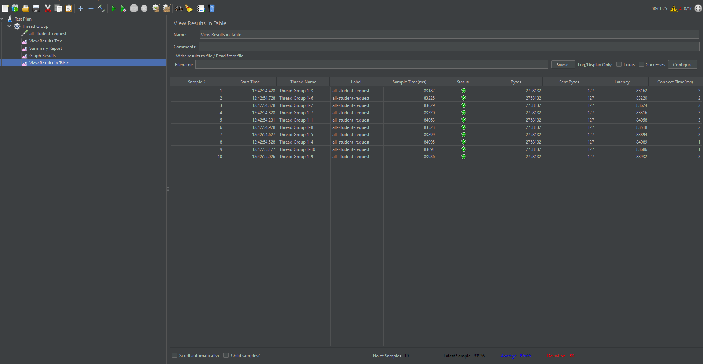
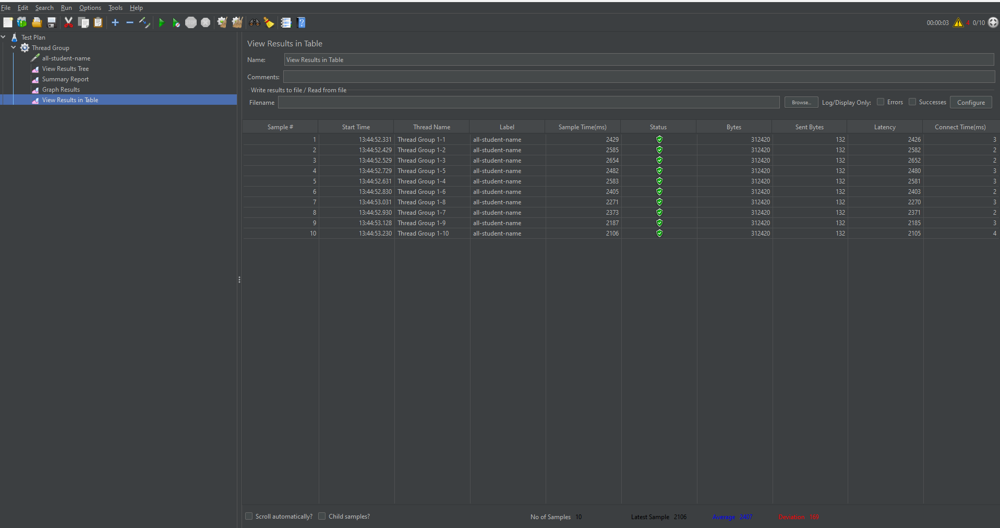
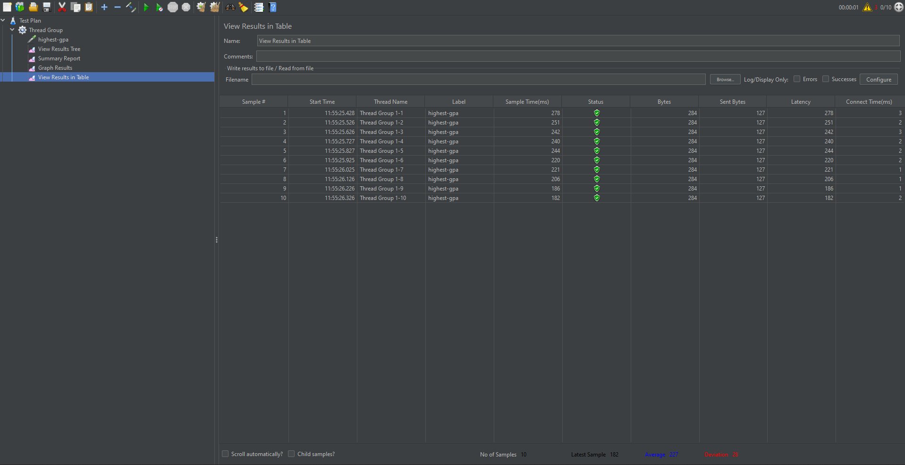
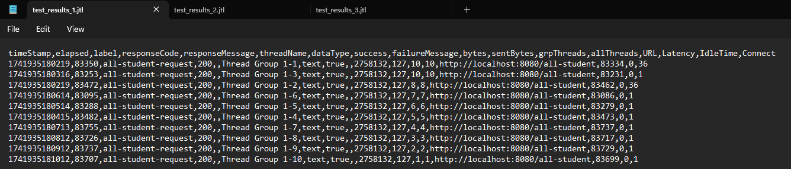
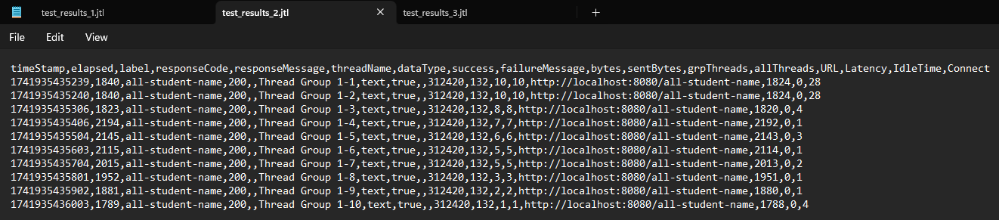
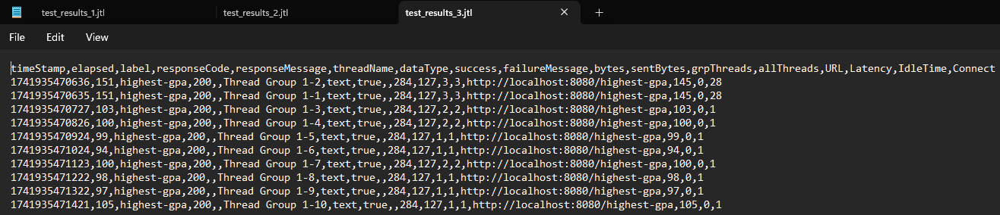

# TEST VIA GUI

# TEST VIA COMMAND LINE

# Kesimpulan Pengujian Performa
Setelah proses profiling dan optimasi performa selesai, dilakukan kembali pengujian performa menggunakan JMeter. Hasil pengujian menunjukkan perbaikan yang signifikan pada dua endpoint utama, yaitu:

Endpoint all-student-request:

Sebelum: Waktu respons berkisar antara 83.000–84.000 ms (sekitar 83 detik).
Sesudah: Waktu respons berkisar antara 488–713 ms (kurang dari 1 detik).
Kesimpulan: Terjadi penurunan waktu respons yang sangat signifikan.
Endpoint all-student-name:

Sebelum: Waktu respons berkisar antara 1.789–2.194 ms.
Sesudah: Waktu respons berkisar antara 141–203 ms.
Kesimpulan: Terjadi perbaikan performa dengan penurunan waktu respons hampir 10 kali lipat.
Sedangkan untuk endpoint highest-gpa, terdapat fluktuasi:

Sebelum: Waktu respons berkisar antara 94–151 ms.
Sesudah: Waktu respons berkisar antara 83–176 ms.
Kesimpulan: Meskipun ada beberapa kasus yang menunjukkan peningkatan, perbedaan performa tidak terlalu signifikan atau konsisten seperti dua endpoint lainnya.
Secara keseluruhan, hasil pengujian JMeter menunjukkan adanya peningkatan performa aplikasi pada sebagian besar endpoint setelah dilakukan proses optimasi.

# Refleksi dan Pembelajaran
1. Perbedaan Pendekatan Pengujian Performa dengan JMeter dan Profiling dengan IntelliJ Profiler:
Pengujian performa menggunakan JMeter lebih bersifat black-box, mengukur performa aplikasi dari luar (seperti waktu respons, throughput, dan beban) dengan mensimulasikan trafik pengguna. Sedangkan profiling dengan IntelliJ Profiler dilakukan secara white-box, yang memberikan wawasan mendalam terhadap penggunaan CPU, memori, dan jejak eksekusi di dalam kode aplikasi. Pendekatan ini saling melengkapi dalam optimasi performa.

2. Peran Profiling dalam Mengidentifikasi Titik Lemah Aplikasi:
Proses profiling membantu dalam mengidentifikasi area dalam kode yang memakan waktu eksekusi berlebih atau penggunaan sumber daya yang tinggi. Dengan menganalisis hotspot, kita dapat fokus pada bagian kode yang perlu dioptimasi untuk mengurangi bottleneck dan meningkatkan efisiensi aplikasi.

3. Efektivitas IntelliJ Profiler dalam Analisis Bottleneck:
IntelliJ Profiler cukup efektif dalam memberikan gambaran mengenai performa internal aplikasi, sehingga memudahkan identifikasi bottleneck di level kode. Namun, hasil profiling perlu dibandingkan dengan hasil pengujian performa eksternal seperti JMeter untuk mendapatkan gambaran yang utuh.

4. Tantangan dalam Pengujian Performa dan Profiling:
- Menyiapkan lingkungan pengujian yang konsisten dan menyerupai kondisi produksi.
- Mengelola overhead yang ditimbulkan oleh tool profiling.
- Menganalisis data yang sangat besar dan kompleks.
- Tantangan tersebut diatasi dengan melakukan pengujian berulang, membandingkan hasil dari berbagai tool, serta mengisolasi kasus-kasus spesifik untuk analisis lebih mendalam.

5. Manfaat Utama dari Penggunaan IntelliJ Profiler:
- Mendapatkan insight tentang penggunaan sumber daya secara detail.
- Mengidentifikasi metode atau bagian kode yang menyebabkan bottleneck.
- Mempermudah proses refactoring dan optimasi kode dengan data yang konkrit.

6. Menangani Inkonsistensi Hasil antara IntelliJ Profiler dan JMeter:
Ketika terjadi ketidaksesuaian hasil, langkah yang dilakukan adalah:
- Melakukan analisis lebih lanjut untuk mengidentifikasi penyebab perbedaan.
- Menjalankan pengujian berulang untuk memastikan tren performa.
- Menggabungkan data dari kedua alat untuk mendapatkan gambaran yang lebih komprehensif dan memastikan bahwa optimasi yang diterapkan benar-benar efektif.

7. Strategi Optimasi Kode Aplikasi:
- Analisis dan Refactoring: Memperbaiki dan mengoptimalkan algoritma atau logika kode yang tidak efisien.
- Caching: Mengimplementasikan mekanisme caching untuk mengurangi beban pemrosesan data berulang.
- Pengujian Regresi: Melakukan pengujian fungsional secara menyeluruh setelah optimasi untuk memastikan tidak ada fungsi aplikasi yang terganggu.
- Monitoring Berkelanjutan: Melakukan pemantauan performa secara terus-menerus untuk mendeteksi dan mengatasi bottleneck sedini mungkin.
